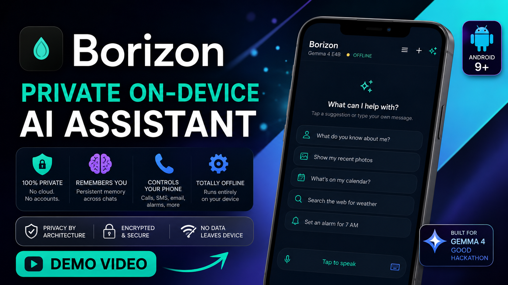

<div align="center">

# Borizon

**Private on-device AI assistant for Android**

It remembers you. It controls your phone. It runs entirely offline.

*No cloud · No accounts · No data leaves your device*

Built for the **[Gemma 4 Good Hackathon](https://www.kaggle.com/competitions/gemma-4-good-hackathon)**

<p>


</p>

[**Watch the demo on YouTube →**](https://www.youtube.com/watch?v=xV_Km7zY8q8)

<a href="https://www.youtube.com/watch?v=xV_Km7zY8q8">

</a>

</div>

---

## What It Does

Borizon gives the Gemma 4 model **real agency** on your phone — not just chat, but action.

| Feature | Description |
|---------|-------------|
| **Memory** | Tell it something once. It remembers across conversations and forgets on request |
| **Phone Control** | Calls, SMS, email, alarms, timers, calendar, contacts — all by voice or text |
| **Notifications** | Search your notification history, summarised by app or sender |
| **Shell** | Sandboxed terminal for files, system info, diagnostics |
| **Web Search** | *Optional* — bring your own Brave Search API key |
| **Skills** | Composable routines: morning briefings, study sessions, wellness checks |

---

## Privacy

Privacy by architecture, not policy.

| | |
|---|---|
| **Inference** | On-device via LiteRT-LM — no API calls |
| **Storage** | SQLCipher with key in hardware security chip |
| **Access** | Biometric lock (fingerprint or face) on every open |
| **Identity** | No account, no sign-up, no email |
| **Telemetry** | None — zero analytics, crash reporting, or usage data |
| **Network** | Only first launch (model download) and optional web search |

---

## Requirements

- **Android 9+** (API 28)
- **6 GB+ RAM** (E2B) / **8 GB+ RAM** (E4B)
- **~4 GB free storage**

---

## Install

**Option 1 — Download APK**

Grab the latest from the [releases page](https://github.com/stawils/borizon/releases).

**Option 2 — Build from source**

```bash
git clone https://github.com/stawils/borizon.git
cd borizon
./gradlew assembleDebug
./gradlew installDebug
```

---

## First Launch

1. **Grant permissions** — microphone, contacts, calendar, SMS
2. **Enable notification access** — *Settings → Apps → Borizon → Notification access*
3. **Choose your model** (see below)
4. **Wait for download** (~2.6–3.7 GB)
5. **Set up biometric lock**
6. **Start talking**

No internet needed after setup.

---

## Model Selection

| | **E2B** | **E4B** |
|---|---------|---------|
| **Download** | ~2.6 GB | ~3.7 GB |
| **RAM** | 6 GB | 8 GB |
| **Tools** | 13 | 14 (includes Skills) |
| **Best for** | Mid-range phones, faster responses | Flagship phones, higher quality |

E4B is the default.

---

## Tools

The model picks tools automatically based on what you say. No setup needed.

| Category | Tools |
|----------|-------|
| Communication | Make calls · Send SMS · Send email |
| Scheduling | Set alarms · Set timers · Calendar events |
| Contacts | Search · Create · Call history · SMS history |
| Memory | Save facts · Search memories · Delete |
| Notifications | Read history · Search by app or sender |
| System | Storage info · System info · Installed apps |
| Files | Browse files (sandboxed shell) |
| Web | Search · Fetch page content *(optional API key)* |
| Apps | Open apps · Open URLs · Open settings · Share |
| Skills *(E4B)* | Morning briefing · Phone status · Study · Wellness · Travel |

---

## Architecture

Built with:

- **LiteRT-LM** — on-device inference runtime
- **Gemma 4** (E2B / E4B) — Google DeepMind, Apache 2.0
- **Room + SQLCipher** — encrypted local storage
- **Kotlin + Jetpack Compose** — 99 files, ~18,000 lines

<details>
<summary>Key numbers</summary>

- 14 tools · 10 screens · 20 UI components
- Sandboxed shell with command blocklist
- GPU → CPU automatic fallback
- Adaptive KV cache sizing based on device RAM

</details>

<details>
<summary>Documentation</summary>

| Doc | Description |
|-----|-------------|
| [Architecture](docs/guides/ARCHITECTURE.md) | AI pipeline, data layer, tool system |
| [Tool Reference](docs/guides/TOOLS.md) | Every tool with parameters and permissions |
| [Privacy & Security](docs/guides/PRIVACY.md) | Encryption, threat model, shell security |
| [Getting Started](docs/guides/GETTING-STARTED.md) | Build, develop, extend |

</details>

---

## License

Apache License 2.0. See [LICENSE](LICENSE).

Borizon uses [Gemma 4](https://ai.google.dev/gemma) by Google DeepMind, also licensed under Apache 2.0.
